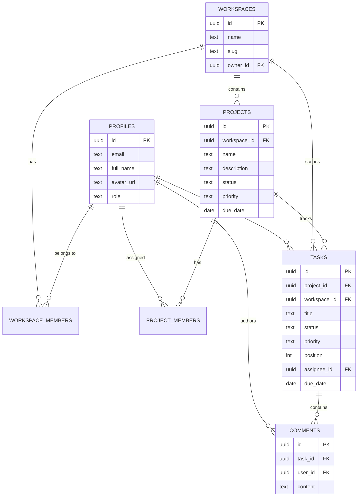

# 🚀 TeamFlow

<div align="center">

  <p align="center">
    <strong>Modern, Real-Time Collaborative Workspace & Kanban Project Management Platform</strong>
  </p>

  <p align="center">
    <a href="#-key-features">Features</a> •
    <a href="#-tech-stack">Tech Stack</a> •
    <a href="#-architecture--project-structure">Architecture</a> •
    <a href="#-database--schema">Database & RLS</a> •
    <a href="#-getting-started">Getting Started</a> •
    <a href="#-environment-variables">Environment</a> •
    <a href="#-scripts">Scripts</a>
  </p>

  <p align="center">
    
    
    
    
    
    
  </p>
</div>

---

## 📖 Overview

**TeamFlow** is an enterprise-ready, collaborative workspace and project management application built with **React 19**, **Vite**, **Tailwind CSS**, and **Supabase**. It delivers a seamless, high-performance experience for teams to organize workspaces, track projects, visualize workflows on an interactive **Kanban Board**, assign tasks, manage deadlines, and converse in real time.

Designed with **Row Level Security (RLS)** at its foundation, TeamFlow ensures strict multi-tenant isolation, granular role-based permissions (`Owner`, `Admin`, `Member`, `Viewer`), and instant synchronization with PostgreSQL.

---

## ✨ Key Features

### 🏢 Workspace Multi-Tenancy
- **Organization Isolation**: Create and switch across multiple workspaces seamlessly.
- **Role-Based Access Control (RBAC)**: Support for `Owner`, `Admin`, `Member`, and `Viewer` roles with tailored permissions.
- **Team Management**: Invite team members, configure member permissions, and manage organization hierarchy.

### 📁 Project Management
- **Lifecycle Tracking**: Organize work into projects with priority tags (`Low`, `Medium`, `High`, `Urgent`) and status tracking (`Planning`, `Active`, `On Hold`, `Completed`).
- **Project Members**: Assign workspace members to specific projects with granular project-level visibility.
- **Timeline & Deadlines**: Set target start dates, due dates, and monitor progress.

### 📋 Interactive Kanban Board & Tasks
- **Workflow Columns**: Visualize tasks across stages: `Backlog`, `To Do`, `In Progress`, `In Review`, and `Done`.
- **Drag-and-Drop / Instant Reordering**: Smooth card interactions and real-time status transitions.
- **Comprehensive Task Details**:
  - Assignees, priority badges, due dates, and rich text descriptions.
  - Position-based sorting within columns.
- **Discussions & Comments**: Built-in commenting system with user profile integration and audit timestamps.
- **Filter & Search**: Quick filtering by priority, assignee, status, and title search.

### 🔐 Authentication & Profiles
- **Secure Supabase Auth**: Email/password authentication with encrypted session management.
- **Password Recovery**: Complete forgot password and reset password token workflows.
- **Customizable Profiles**: User avatars, full names, usernames, and profile bios.
- **Route Guards**: Public-only routes (`/login`, `/signup`) and protected dashboard routes (`/app/*`).

### 🎨 Modern UI / UX
- **Responsive Layout**: Designed for mobile, tablet, and desktop viewports.
- **Design System**: Built with Tailwind CSS, custom modern color palettes, glassmorphism accents, and Lucide React iconography.
- **State Feedback**: Context-driven Toast notification system and loading skeletons.

---

## 🛠 Tech Stack

| Layer | Technology | Description |
| :--- | :--- | :--- |
| **Frontend Framework** | [React 19](https://react.dev/) | Component architecture & modern React primitives |
| **Build Tooling** | [Vite 8](https://vitejs.dev/) | Lightning-fast HMR and bundle optimization |
| **Routing** | [React Router v7](https://reactrouter.com/) | Client-side routing, layouts, and route guards |
| **Styling** | [Tailwind CSS v3](https://tailwindcss.com/) | Utility-first, responsive design system |
| **Backend & Auth** | [Supabase](https://supabase.com/) | Managed PostgreSQL, Auth, and Storage |
| **Database Security** | PostgreSQL RLS | Row Level Security policies per workspace & user |
| **Icons** | [Lucide React](https://lucide.dev/) | Consistent, lightweight SVG icon set |
| **Linter / Linter Tool** | [Oxlint](https://oxc.rs/) | High-speed JavaScript/JSX code quality checker |

---

## 📐 Architecture & Project Structure

```text
TeamFlow/
├── public/                     # Static public assets & favicon
├── src/
│   ├── assets/                 # App images, logos, and illustrations
│   ├── components/
│   │   ├── common/             # Reusable UI (Header, Sidebar, EmptyState, ErrorBoundary)
│   │   ├── layout/             # Navigation bars, wrappers, and view shells
│   │   ├── projects/           # Project modals, member pickers, project cards
│   │   ├── tasks/              # KanbanBoard, TaskCard, TaskDetailModal, TaskFilters
│   │   ├── ui/                 # Base buttons, inputs, modals, dropdowns, badges
│   │   └── workspaces/         # Workspace switcher & creation modals
│   ├── context/                # React Contexts (AuthContext, WorkspaceContext, ToastContext)
│   ├── hooks/                  # Custom hooks (e.g., useWorkspace, useAuth, useDebounce)
│   ├── layouts/                # Route layouts (AppLayout, AuthLayout)
│   ├── lib/                    # Supabase client singleton (supabaseClient.js)
│   ├── pages/                  # Top-level route pages (Kanban, Workspaces, Auth, etc.)
│   ├── routes/                 # App routing definition and route protection guards
│   ├── services/               # API service layer (authService, projectService, taskService)
│   ├── utils/                  # Constants, formatters, and helper functions
│   ├── App.jsx                 # App root with providers & routing tree
│   ├── index.css               # Global styles & Tailwind directives
│   └── main.jsx                # Application bootstrap entry point
├── supabase/
│   └── migrations/             # SQL schemas, RLS policies, functions, and triggers
│       ├── 001_initial_schema.sql
│       ├── 002_project_fields.sql
│       └── 003_tasks_and_comments.sql
├── .env.example                # Sample environment configuration template
├── package.json                # Project dependencies and script runner
├── tailwind.config.js          # Tailwind CSS design system tokens
└── vite.config.js              # Vite bundler configuration
```

---

## 🗄 Database & Schema

TeamFlow uses PostgreSQL hosted on Supabase. Relational integrity is enforced using foreign keys and cascading rules.



### Row Level Security (RLS)
- **Data Isolation**: Workspaces, projects, tasks, and comments enforce RLS.
- **Membership Checks**: Helper SQL functions (e.g. `is_workspace_member()`, `get_workspace_role()`) prevent cross-workspace data leakage.
- **Triggers**: Automated timestamp management (`handle_updated_at()`) on updates.

---

## 🚦 Getting Started

### 1. Prerequisites
- **Node.js**: `v18.0.0` or higher
- **npm**: `v9.0.0` or higher (or `yarn` / `pnpm`)
- **Supabase Account**: A free Supabase cloud account (or a local Supabase CLI instance)

### 2. Clone the Repository
```bash
git clone https://github.com/sakshishewale01/TeamFlow.git
cd TeamFlow
```

### 3. Install Dependencies
```bash
npm install
```

### 4. Configure Environment Variables
Create a local `.env` file from the provided `.env.example`:

```bash
cp .env.example .env
```

Open `.env` and fill in your Supabase project credentials:

```env
VITE_SUPABASE_URL=https://your-project-ref.supabase.co
VITE_SUPABASE_PUBLISHABLE_KEY=your-supabase-anon-key
```

> **Where to find them**: In your Supabase Dashboard, go to **Project Settings** → **API** to copy the Project URL and anon public key.

### 5. Run Database Migrations
Execute the migration scripts in order inside your Supabase **SQL Editor**:

1. `supabase/migrations/001_initial_schema.sql` (or `20260905000001_create_profiles_and_roles.sql` & `20260905000002_create_workspaces_and_projects.sql`)
2. `supabase/migrations/002_project_fields.sql`
3. `supabase/migrations/003_tasks_and_comments.sql`

### 6. Start the Development Server
```bash
npm run dev
```

Open [http://localhost:5173](http://localhost:5173) in your browser.

---

## ⚙️ Environment Variables

| Variable | Required | Description |
| :--- | :---: | :--- |
| `VITE_SUPABASE_URL` | **Yes** | The base HTTPS URL of your Supabase project instance |
| `VITE_SUPABASE_PUBLISHABLE_KEY` | **Yes** | Supabase anonymous public API key (`anon` / `publishable`) |

---

## 📜 Available Scripts

In the project root, you can run:

| Command | Action |
| :--- | :--- |
| `npm run dev` | Starts the Vite development server with Hot Module Replacement (HMR) |
| `npm run build` | Compiles and bundles production-ready assets into the `dist/` directory |
| `npm run preview` | Locally serves and previews the production build from `dist/` |
| `npm run lint` | Runs [Oxlint](https://oxc.rs/) to detect syntax, linting, and quality issues |

---

## 🗺 Roadmap

- [x] Multi-tenant Workspace management & role delegation
- [x] Project creation, filtering, and priority tracking
- [x] Full Kanban Board with drag-and-drop workflow stages
- [x] Task assignment, due date alerts, and priority badges
- [x] Real-time task comments and discussions
- [ ] Real-time updates via Supabase Realtime Channels / WebSockets
- [ ] File attachments on task cards using Supabase Storage buckets
- [ ] Email invitation notifications for workspace members
- [ ] Activity logs and analytics dashboard

---

## 🤝 Contributing

Contributions make the open-source community an amazing place to learn, inspire, and create. Any contributions you make are **greatly appreciated**.

1. Fork the Project
2. Create your Feature Branch (`git checkout -b feature/AmazingFeature`)
3. Commit your Changes (`git commit -m "feat: add some AmazingFeature"`)
4. Push to the Branch (`git push origin feature/AmazingFeature`)
5. Open a Pull Request

---

## 📄 License

Distributed under the **MIT License**. See `LICENSE` for more information.

---

<div align="center">
  <sub>Built with ❤️ using React 19 & Supabase by <a href="https://github.com/sakshishewale01">Sakshi Shewale</a> and contributors.</sub>
</div>
